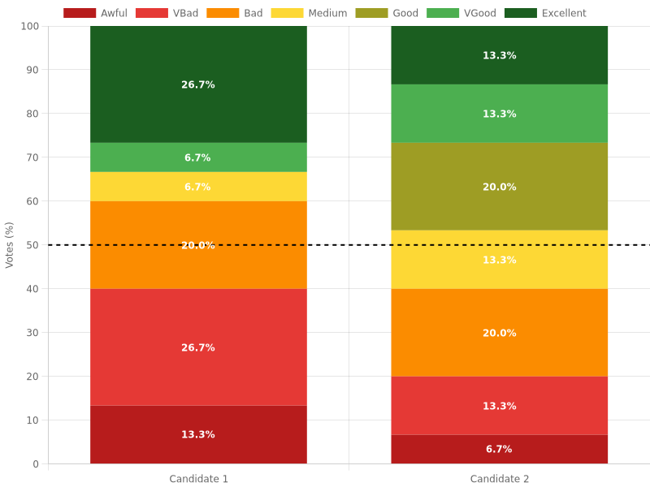

# FHEVM MJVS
This repository showcases a proof of concept (POC) of a Confidential Majority Judgement Voting System (see [wikepedia](https://en.wikipedia.org/wiki/Majority_judgment) page) deployed on-chain using Fully Homomorphic Encryption (FHE), powered by Zama’s [FHEVM](https://github.com/zama-ai/fhevm) framework.

<br />

⚠️ **Note:** This is a technical POC intended to demonstrate the feasibility of privacy-preserving voting on blockchain. Not production-ready.
<br />
<br />

## 🔍 How the Voting System Works

### ➤ 🗳️ Voting Flow (Step by Step)

1. **Vote preparation:**
   - Each voter selects a grade **for each candidate** using the **Majority Judgement scale**:
     - Awful, Very Bad, Bad, Medium, Good, Very Good, Excellent.
   - Grades are encoded as **one-hot bit values** in a 7-bit integer:
     - Example: Medium = `0001000` → decimal `8`.
   - The grade is then **encrypted locally using the FHEVM SDK**, producing an encrypted value `euint8`, along with a **Zama Gateway proof** to confirm correct encryption.

2. **On-chain vote submission:**
   - The voter submits:
     - Its vote as an array of bit (for example `0001000`, so an encrypted 8)
     - A cryptographic proof (`inputProof`) validated by the Zama Gateway.
   - Example from the test:
     ```typescript
     await this.voteContract.vote([encryptedVote.handles[0], encryptedVote.handles[1]], encryptedVote.inputProof,);
     ```

3. **On-chain vote aggregation:**
   - The smart contract processes the encrypted grades using FHE arithmetic.
   - It splits the encrypted 7-bit vote into 7 encrypted counters (one for each grade). Following our example we will have 0 VGood, 0 Good ... 1 Medium .., 0 VBad; these numbers will be added to the total vote count. As those are encrypted numbers, no one can tell if a 1 or a 0 is added to the vote count.
   - Each candidate has **encrypted counters** like:
     - `candidateScore[candidateId].Excellent`, `candidateScore[candidateId].Medium`, etc.
   - Votes are **added homomorphically**:
     ```solidity
     candidateScore[candidateId].Medium = FHE.add(candidateScore[candidateId].Medium, gradeArray[3]);
     ```
   - No one, including the contract owner, can decrypt these counters at this stage.

4. **Decryption of aggregate results:**
   - When voting ends, the contract owner requests the decryption of **the total votes for each grade of a candidate**.
   - This triggers a call to the **Zama Gateway**, which securely decrypts the encrypted counters and calls the contract back with the clear text results.

5. **Public results:**
   - After decryption, the contract stores the total number of votes for each grade **for each candidate**, which is publicly visible.
   - Example:
     - Candidate 1:
       - Excellent: 5
       - Very Good: 12
       - Medium: 8
       - etc.

<br />


### 🔐 **Key Confidentiality Principle**

➡️ **Individual votes are never decrypted.**

✅ Only the **aggregated total per grade per candidate** is decrypted.  
✅ No one can know who voted for what grade.  
✅ Even if you vote “Very Good” for a candidate, only the **total number of “Very Good” votes** is revealed in the end.

<br />
<br />

## 🛡️ Fraud Detection

In the MJVS_POC voting system, it is essential to ensure that each vote for a candidate is **valid** and corresponds to **only one grade**. A fraudulent vote could attempt to cast multiple grades simultaneously by setting more than one bit in the encrypted vote.

### 🌟 Goal
✔ Ensure that **only one grade is selected per vote**.  
✔ Automatically reject votes that try to vote for multiple grades at once.  

---

### 🛡️ **How the Fraud Check Works**

Each vote is represented as an 8-bit unsigned encrypted integer (`euint8`). The valid grades correspond to binary numbers with **exactly one `1` bit** (i.e., powers of two):

| Grade     | Binary    | Decimal |
|-----------|------------|---------|
| Excellent | `00000001` | 1       |
| VGood     | `00000010` | 2       |
| Good      | `00000100` | 4       |
| Medium    | `00001000` | 8       |
| Bad       | `00010000` | 16      |
| VBad      | `00100000` | 32      |
| Awful     | `01000000` | 64      |

If a vote has multiple `1`s (e.g., `00001100`, meaning Good **and** Medium), it is considered **fraudulent**.

---

### ⚙️ **Algorithm Summary**

The fraud detection uses a bit manipulation :
- A number `n` is a **power of two** (only one bit set) **if and only if**:
  
  ```solidity
  n & (n - 1) == 0
  ```
  
- This check is applied using encrypted operations with the `FHE` library.
  ```solidity
  ebool underflowRisk = FHE.lt(userVote_, 1);
  euint8 userVoteSafeSub = FHE.select(underflowRisk, FHE.asEuint8(0), FHE.sub(userVote_, 1));
  ebool fraudFlag = FHE.asEbool(FHE.and(userVote_, userVoteSafeSub));
  euint8 safeVote = FHE.select(fraudFlag, FHE.asEuint8(0), userVote_);
  return safeVote;
  ```
  
<br />

### ✅ Example (Valid Vote)

| Vote | Vote - 1 | Vote & (Vote - 1) | Is Valid? |
|-----|----------|--------------------|------------|
| 8 (`00001000`) | 7 (`00000111`) | 0 (`00000000`) | ✅ Yes |

### ❌ Example (Invalid Vote)

| Vote | Vote - 1 | Vote & (Vote - 1) | Is Valid? |
|-----|----------|--------------------|------------|
| 12 (`00001100`) | 11 (`00001011`) | 8 (`00001000`) | ❌ No |

<br />

Inside the contract, this logic is implemented in the `fraudCheck(euint8 userVote_) internal returns (euint8)` function, using the encrypted equivalents of bitwise operations and comparisons.

If the vote is invalid:
- The fraud check returns **0**, meaning **no grade is incremented** for the candidate.
- This prevents fraudulent votes from affecting the results.

<br />

Fraud detection summary :
- ✅ Accepts only encrypted powers of two (`1`, `2`, `4`, `8`, `16`, `32`, `64`).
- ❌ Rejects any value with multiple bits set.

<br />

## 🔑 Key Features

- **Confidential Voting:** Votes are encrypted end-to-end using FHE. Votes remain confidential even on-chain.
- **Majority Judgement Mechanism:** Each candidate's score is evaluated on a 7-grade scale (from Awful to Excellent).
- **Secure Decryption:** Encrypted tallies are decrypted securely using Zama’s Gateway service, and results are transparently published.
- **Fraud check:** Ensures all votes are licit.
- **On-chain Vote Aggregation:** All vote processing, tallying, and storage happens on-chain using encrypted data types (`euint32`, `euint8`).
- **Built with Solidity 0.8.24** and **Zama's FHEVM libraries**.

<br />
<br />

## 🏆 How is the winner determined?

---

### ➤ **Step 1: Aggregate all votes per candidate**

For each candidate, you have the decrypted total number of votes for each grade:

| Grade      | Votes |
|------------|-------|
| Excellent  |   5   |
| Very Good  |   7   |
| Good       |  10   |
| Medium     |   8   |
| Bad        |   2   |
| Very Bad   |   1   |
| Awful      |   1   |

The sum of all these numbers gives the total number of votes cast for that candidate.


### ➤ **Step 2: Compute the median grade**

1. **List all grades ordered from best to worst:**

   \`Excellent > Very Good > Good > Medium > Bad > Very Bad > Awful\`

2. Start adding the number of votes from the best grade down.
3. The **grade where you cross the halfway point of total votes** is the **median grade** of the candidate.

**Example:**  
Total votes = 5 + 7 + 10 + 8 + 2 + 1 + 1 = 34  
Half of 34 is 17.

- Excellent: 5 → cumulative total = 5
- Very Good: 7 → cumulative total = 12
- Good: 10 → cumulative total = 22 → the median is crossed here.

✅ Median grade for this candidate is **Good**.


### ➤ **Step 3: Compare candidates**

- The **candidate with the best median grade wins**.
   - Example: Candidate A has a median of Good, Candidate B has a median of Very Good → Candidate B wins.
- If two candidates have the same median grade, the tie-breaker is:
   - Compare the **number of votes** in that median grade and better ones.
   - If still tied, follow Majority Judgement tie-break rules (compare vote profiles in detail).

<br />
<br />


## ✅ Why is this better than "highest total votes"?

- **Majority Judgement** measures the **quality of support**, not just the quantity.
- A candidate with many "Medium" votes but few negative ones may beat a polarizing candidate with many "Excellent" and "Awful" votes.
- This helps elect the **most broadly appreciated** candidate, not necessarily the most divisive.

See image below :

<br />



<br />
<br />

## 🔨 Smart Contract Summary

### Contract: `MJVS_POC.sol`

- `setVotingState(bool _state) public onlyOwner `: Open/close voting (owner-only).
- `vote(externalEuint8[] calldata encryptedUserVote, bytes calldata inputProof) public ensureVotingOpen`: Submit encrypted votes for candidates.
- `requestResult(uint256 candidateId) public onlyOwner`: Request decryption of a candidate's final score (owner-only).
- `resultCallback(...)`: Called by the Gateway to set the clear-text result on-chain.
- Grades tracked:
  - Excellent
  - Very Good
  - Good
  - Medium
  - Bad
  - Very Bad
  - Awful

## 🧪 Testing the Contract

The test suite uses **Hardhat**, **Chai**, and helper scripts for interaction with the FHE Gateway.

### Test Coverage:

- ✅ Deployment of the voting contract
- ✅ Opening the voting session
- ✅ Submitting **30 random encrypted votes**
- ✅ Requesting decryption of vote results
- ✅ Displaying the final decrypted scores
- ✅ Generating a score chart (off-chain)

### Install & Run tests:
```
npm install
```
```
npx hardhat test
```
For additional information, please refer to Zama's FHEVM Hardhat Template documentation below.

<br />
<br />

## 📜 License

This project contains components under different licenses:

- Parts of this project are licensed under the **MIT License**, inherited from the original template.
- The original contributions in this repository (including the MJVS smart contract and test logic) are licensed under the **BSD 3-Clause Clear License**.

<br />
<br />


# FHEVM Hardhat Template

A FHEVM Hardhat-based template for developing Solidity smart contracts.

# Quick Start

- [FHEVM Hardhat Quick Start Tutorial](https://docs.zama.ai/protocol/solidity-guides/getting-started/quick-start-tutorial)

# Documentation

- [The FHEVM documentation](https://docs.zama.ai/fhevm)
- [How to set up a FHEVM Hardhat development environment](https://docs.zama.ai/protocol/solidity-guides/getting-started/setup)
- [Run the FHEVM Hardhat Template Tests](https://docs.zama.ai/protocol/solidity-guides/development-guide/hardhat/run_test)
- [Write FHEVM Tests using Hardhat](https://docs.zama.ai/protocol/solidity-guides/development-guide/hardhat/write_test)
- [FHEVM Hardhart Plugin](https://docs.zama.ai/protocol/solidity-guides/development-guide/hardhat)
